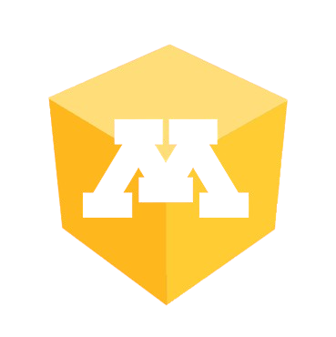
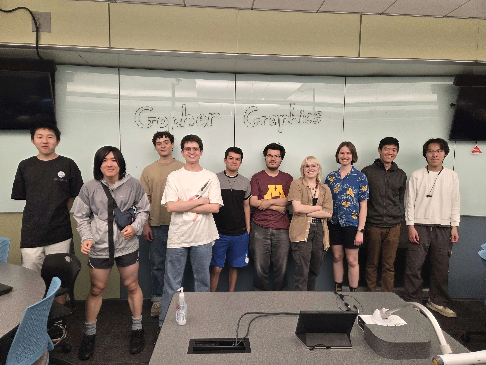

<p align="center">
  
</p>

<h1 align="center">Gopher Graphics</h1>

<p align="center">
  <strong>The Computer Graphics Club at the University of Minnesota</strong>
</p>

---

Full stack web platform for Gopher Graphics. The site serves as a hub for members to showcase projects, message each other, and stay connected.

<p align="center">
  
</p>

## Features

**Real Time Messaging** — Channel based group chat and direct messages with image attachments, reply threading, and 3 second polling for near instant updates.

**Project Showcase** — Members upload projects with image carousels, tech stacks, and descriptions. Filter by tag, sort by date, and click through to full detail views.

**Member Profiles** — Each member gets a public profile page displaying their projects, favorite languages, links, and club stats.

**Authentication** — JWT based auth with bcrypt password hashing, rate limited login/signup endpoints, and role based access control.

## Tech Stack

| Layer        | Tech                                                  |
| ------------ | ----------------------------------------------------- |
| **Frontend** | React, TypeScript, Vite, Tailwind CSS, TanStack Query |
| **Backend**  | Express, TypeScript, JWT, bcrypt                      |
| **Database** | PostgreSQL                                            |
| **Infra**    | Docker, Google Cloud Run, Cloud SQL                   |
| **CI/CD**    | GitHub Actions                                        |

## Project Structure

```
├── Client/                 # react frontend
│   ├── src/
│   │   ├── api/            # http client and api functions
│   │   ├── components/     # reusable ui components
│   │   ├── contexts/       # auth context provider
│   │   ├── pages/          # route-level page components
│   │   ├── types/          # shared typescript interfaces
│   │   └── util/           # image processing helpers
│   └── package.json
│
├── Server/                 # express api server
│   ├── src/
│   │   ├── routes/         # users, projects, channels, direct messages
│   │   ├── middleware/     # jwt auth middleware
│   │   ├── util/           # response helpers, validators, uploads
│   │   └── tests/          # vitest test suites
│   ├── init.sql            # database schema
│   └── package.json
│
├── .github/workflows/      # ci/cd pipeline
├── Dockerfile              # multi stage production build
├── docker-compose.yml      # local postgres for development
└── README.md
```

## Getting Started

### Prerequisites

- Node.js
- Docker (for the database)

### Local Development

**1. Start the database**

```bash
docker compose up -d
```

This creates a PostgreSQL instance and runs the schema automatically.

**2. Start the API server**

```bash
cd Server
cp .env.example .env    # configure DB_HOST, JWT_SECRET, etc.
npm install
npm run dev
```

The server starts on `http://localhost:3001`.

**3. Start the frontend**

```bash
cd Client
npm install
npm run dev
```

The client starts on `http://localhost:5173`.

### Running Tests

```bash
cd Server
npm test
```

## Deployment

The app deploys automatically to **Google Cloud Run** on every push to `main` via GitHub Actions.

The pipeline:

1. Builds a multi stage Docker image (React client -> Express server)
2. Pushes the image to Google Artifact Registry
3. Deploys to Cloud Run with Cloud SQL connectivity

## Contributing

CREATE YOUR OWN BRANCH FIRST. DO NOT PUSH TO MAIN. Every push to main will be immediately deployed to production.

This project is open to all Gopher Graphics club members to contribute.
